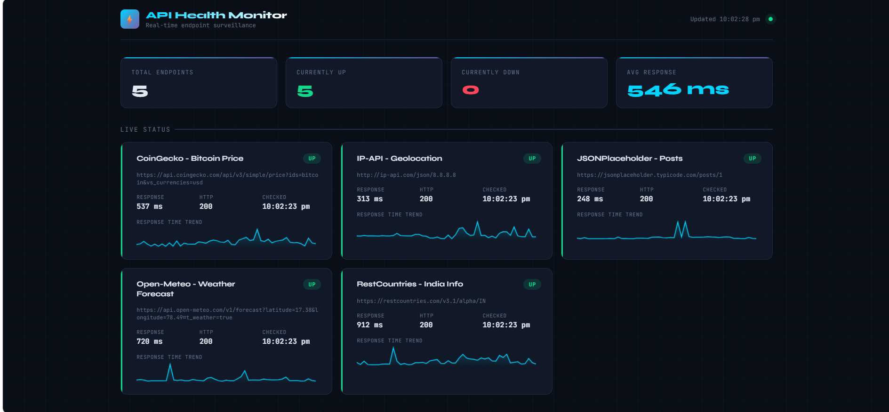

# 🚦 API Health Check Monitor

> A production-ready REST API monitoring system with real-time web dashboard, historical analytics, multi-channel alerts, CLI reporting, and Docker support — built with Python, Flask, SQLite, and YAML.


---

## 📸 Dashboard Preview



---

## 🎯 What This Does

Continuously monitors REST API endpoints and tells you:
- Is the API **alive**?
- How **fast** is it responding?
- Is the **response data correct** — not just status 200, but actual content?
- Has it been **reliably up** over time?
- Who gets **notified** when something breaks?

---

## ✨ Features

| Feature | Details |
|---|---|
| **Real-time Monitoring** | 5 public APIs checked every 30s in parallel threads |
| **3-Layer Validation** | HTTP status + required JSON keys + exact value assertions |
| **Live Web Dashboard** | Flask UI with status cards, Chart.js analytics, sparkline trends |
| **Analytics Charts** | Uptime % bar chart, avg response time chart, health pie chart |
| **Historical Logging** | Every check persisted to SQLite — full trend analysis |
| **Multi-channel Alerts** | Console (always) + Email (SMTP) + Slack (Webhook) |
| **CLI Report Mode** | `--report` prints uptime summary without starting dashboard |
| **YAML Configuration** | Add/remove endpoints with zero code changes |
| **DEGRADED Detection** | Catches slow-but-alive APIs before they fully fail |
| **Docker Support** | One command to run anywhere with `docker-compose up` |

---

## 🏗️ Architecture

```
config.yaml  ←  single source of truth for all settings
     │
     ▼
main.py  (entry point — orchestrates everything)
     │
     ├──► Thread 1: monitor.py     ←  polls all APIs in parallel every 30s
     │         ├──► validator.py   ←  3-layer response validation
     │         ├──► alerts.py      ←  console / email / Slack notifications
     │         └──► database.py    ←  writes every result to SQLite
     │
     └──► Thread 2: dashboard.py   ←  Flask web UI, reads from SQLite
               ├── GET /            ←  main dashboard page
               ├── GET /api/status  ←  current status (JSON)
               ├── GET /api/stats   ←  uptime statistics (JSON)
               └── GET /api/history ←  check log (JSON)
```

### Data Flow — Step by Step

```
          ┌─────────────┐
          │ config.yaml │  defines endpoints, thresholds, alert settings
          └──────┬──────┘
                 │ load_config()
                 ▼
          ┌─────────────┐     spawn thread      ┌──────────────────┐
          │   main.py   │ ─────────────────────► │   monitor.py     │
          │             │                         │  (daemon thread) │
          │  Flask runs │                         └────────┬─────────┘
          │  on main    │                                  │ every 30s
          │  thread     │        ┌─────────────────────────┼──────────────────┐
          └──────┬──────┘        │                         │                  │
                 │               ▼                         ▼                  ▼
                 │       ┌──────────────┐        ┌──────────────┐   ┌──────────────┐
                 │       │ validator.py │        │  alerts.py   │   │ database.py  │
                 │       │ checks JSON  │        │ fires if DOWN│   │ INSERT every │
                 │       │ keys+values  │        │ console/email│   │ result to DB │
                 │       └──────────────┘        │ /slack       │   └──────┬───────┘
                 │                               └──────────────┘          │
                 │                                                          │ SELECT
                 └──────────────────────────────────────────────────────────┘
                              dashboard reads DB every 15s via AJAX
```

---

## 📁 Project Structure

```
api-health-monitor/
│
├── main.py           ← Entry point: starts monitor thread + Flask dashboard
├── monitor.py        ← Core engine: polls endpoints, dispatches results
├── validator.py      ← HTTP status + JSON key + value validation
├── alerts.py         ← Console / Email / Slack alert dispatcher
├── database.py       ← SQLite read/write for historical logging
├── dashboard.py      ← Flask routes + single-page HTML/JS/Chart.js dashboard
│
├── config.yaml       ← ALL configuration (endpoints, alerts, thresholds)
├── requirements.txt  ← Python dependencies (flask, requests, pyyaml)
├── Dockerfile        ← Container image definition
├── docker-compose.yml← One-command deployment
├── .gitignore        ← Excludes venv, db, pycache
│
└── screenshots/
    └── dashboard.png
```

---

## 🔍 Monitored APIs

| # | Name | URL | Validated Fields |
|---|------|-----|-----------------|
| 1 | JSONPlaceholder | `https://jsonplaceholder.typicode.com/posts/1` | userId, id, title, body; id==1 |
| 2 | Open-Meteo Weather | `https://api.open-meteo.com/v1/forecast` | latitude, longitude, current_weather |
| 3 | RestCountries — India | `https://restcountries.com/v3.1/alpha/IN` | name, capital, region, population |
| 4 | CoinGecko Bitcoin | `https://api.coingecko.com/api/v3/simple/price` | bitcoin key present |
| 5 | IP-API Geolocation | `http://ip-api.com/json/8.8.8.8` | status=="success", query=="8.8.8.8" |

---

## 🛠️ Tech Stack

| Tool | Purpose |
|------|---------|
| Python 3.9+ | Core language |
| Flask | Web dashboard framework |
| Chart.js | Analytics charts (uptime, response time, pie) |
| requests | HTTP client for endpoint checks |
| pyyaml | YAML configuration parsing |
| sqlite3 | Historical data storage (built-in) |
| threading | Parallel endpoint monitoring |
| smtplib | Email alert delivery (built-in) |
| logging | Structured log output (built-in) |
| argparse | CLI flag handling (built-in) |
| Docker | Containerised deployment |

---

## ⚙️ Setup — Local

```bash
# 1. Clone
git clone https://github.com/hemasiri-15/api-health-monitor.git
cd api-health-monitor

# 2. Virtual environment
python3 -m venv venv
source venv/bin/activate        # Linux/Mac
venv\Scripts\activate           # Windows

# 3. Install dependencies
pip install -r requirements.txt

# 4. Run
python3 main.py
```

Open browser: **http://localhost:5000**

---

## 🐳 Setup — Docker

```bash
# Build and start
docker-compose up

# Run in background
docker-compose up -d

# Stop
docker-compose down
```

Open browser: **http://localhost:5000**

---

## 🚀 Usage

```bash
# Start monitoring + dashboard
python3 main.py

# View historical report (terminal only, no dashboard)
python3 main.py --report

# Use a custom config file
python3 main.py --config /path/to/config.yaml

# Access from another device on same WiFi
http://<your-local-ip>:5000
```

**Example `--report` output:**
```
📊 API Health Monitor — Historical Report
=======================================================

  JSONPlaceholder - Posts
  [████████████████████] 100.0% uptime
  Avg response: 187.3 ms | Total checks: 48

  CoinGecko - Bitcoin Price
  [████████████████████] 100.0% uptime
  Avg response: 425.1 ms | Total checks: 48
```

---

## 📊 Dashboard Features

- **Summary Bar** — total endpoints, UP/DOWN count, avg response time
- **Status Cards** — per-endpoint: status badge, HTTP code, response time, timestamp, sparkline trend
- **Uptime Bar Chart** — visual uptime % per endpoint (Chart.js)
- **Response Time Chart** — average response time per endpoint (Chart.js)
- **Health Pie Chart** — UP vs DOWN vs DEGRADED breakdown (Chart.js)
- **Uptime Table** — historical uptime % with visual progress bar
- **Check Log** — last 40 results with status, time, HTTP code, errors
- **Auto-refresh** — AJAX polling every 15 seconds, no page reload

---

## 🔔 Configuring Alerts

Edit `config.yaml`:

**Email (Gmail):**
```yaml
alerts:
  email_enabled: true
  email:
    smtp_server: "smtp.gmail.com"
    smtp_port: 587
    sender_email: "your@gmail.com"
    sender_password: "your-app-password"   # Gmail App Password
    recipient_email: "alerts@email.com"
```
> Generate: Google Account → Security → 2-Step Verification → App Passwords

**Slack:**
```yaml
alerts:
  slack_enabled: true
  slack:
    webhook_url: "https://hooks.slack.com/services/T.../B.../..."
```
> Create at: api.slack.com/apps → Incoming Webhooks

---

## 🔧 Module Reference

### `config.yaml` — Single Source of Truth
Every behaviour is controlled here. No hardcoded values anywhere in Python.

| Key | Controls |
|-----|---------|
| `settings.check_interval_seconds` | How often to poll all endpoints |
| `settings.request_timeout_seconds` | Per-request timeout before giving up |
| `endpoints[].validation.required_keys` | JSON keys that must exist in response |
| `endpoints[].validation.expected_values` | Exact key=value assertions |
| `endpoints[].thresholds.max_response_time_ms` | Slow threshold → triggers DEGRADED |
| `alerts.*` | Toggle and configure each notification channel |

### `monitor.py` — Core Polling Engine

| Function | Purpose |
|----------|---------|
| `load_config(path)` | Parses YAML into Python dict |
| `check_endpoint(ep, timeout)` | Makes one HTTP request, measures response time, returns result dict |
| `run_monitoring_cycle(...)` | Spawns one thread per endpoint — all checks run simultaneously |
| `start_monitoring_loop(config)` | Infinite loop — calls cycle every N seconds |

### `validator.py` — Response Inspector

| Function | Purpose |
|----------|---------|
| `validate_status_code(actual, expected)` | Compares received HTTP code vs expected |
| `validate_required_keys(json, keys)` | Verifies all required keys exist in JSON body |
| `validate_expected_values(json, dict)` | Asserts specific key=value pairs match exactly |
| `run_all_validations(...)` | Runs all three checks, returns merged `ValidationResult` |

**Why 3-layer validation matters:** An API can return HTTP 200 with empty or wrong data — a "silent failure". This catches it.

### `alerts.py` — Notification Dispatcher

| Function | Purpose |
|----------|---------|
| `dispatch_alert(name, status, details, config)` | Routes to all enabled channels — only function monitor.py calls |
| `send_console_alert(...)` | Logs WARNING-level message to stdout |
| `send_email_alert(...)` | Sends HTML email via SMTP with STARTTLS |
| `send_slack_alert(...)` | Posts Block Kit message to Slack Incoming Webhook |

### `database.py` — Persistence Layer

| Function | Purpose |
|----------|---------|
| `initialize_database(path)` | `CREATE TABLE IF NOT EXISTS` on startup |
| `save_result(path, result)` | INSERT one check result (every check, UP or DOWN) |
| `get_uptime_stats(path)` | `GROUP BY` endpoint → uptime % + avg response time |
| `get_latest_per_endpoint(path)` | Most recent result per endpoint (for status cards) |
| `get_response_time_history(path, name, limit)` | Time-series data for sparkline charts |
| `get_recent_results(path, limit)` | Last N results for check log table |

### `dashboard.py` — Web Interface

| Route | Returns |
|-------|---------|
| `GET /` | Full dashboard HTML page |
| `GET /api/status` | Latest status per endpoint (JSON) |
| `GET /api/stats` | Uptime % + avg response per endpoint (JSON) |
| `GET /api/history` | Last 100 check results (JSON) |
| `GET /api/history/<name>` | Response time history for one endpoint (JSON) |

---

## 🗄️ Database Schema

**Table: `monitoring_results`**

| Column | Type | Description |
|--------|------|-------------|
| id | INTEGER PK | Auto-increment row ID |
| endpoint_name | TEXT | Human-readable name from config.yaml |
| url | TEXT | Full URL that was checked |
| timestamp | TEXT | ISO-8601 UTC datetime |
| status | TEXT | `UP`, `DOWN`, or `DEGRADED` |
| http_code | INTEGER | HTTP response code (0 = timeout) |
| response_time | REAL | Duration in milliseconds |
| error_message | TEXT | NULL on success; failure reason otherwise |
| is_valid | INTEGER | 1 = validation passed, 0 = failed |

**Key SQL queries:**
```sql
-- Uptime % per endpoint (used by /api/stats)
SELECT endpoint_name,
       COUNT(*) AS total_checks,
       ROUND(100.0 * SUM(CASE WHEN status='UP' THEN 1 ELSE 0 END) / COUNT(*), 2) AS uptime_pct,
       ROUND(AVG(response_time), 2) AS avg_response_ms
FROM monitoring_results
GROUP BY endpoint_name;

-- Latest result per endpoint (used by status cards)
SELECT * FROM monitoring_results
WHERE id IN (
    SELECT MAX(id) FROM monitoring_results GROUP BY endpoint_name
);
```

---

## ➕ Adding a New Endpoint

Add to `config.yaml` — no code changes needed:

```yaml
- name: "My API"
  url: "https://api.example.com/health"
  method: GET
  expected_status: 200
  validation:
    required_keys:
      - "status"
      - "version"
    expected_values:
      status: "ok"
  thresholds:
    max_response_time_ms: 1500
```

Restart and it's monitored automatically.

---

## 🔮 Future Improvements

- [ ] Telegram / Discord webhook alerts
- [ ] Export logs to CSV
- [ ] GitHub Actions CI pipeline
- [ ] Authentication for dashboard
- [ ] Email digest report (daily summary)
- [ ] Custom check intervals per endpoint
- [ ] Response time SLA breach tracking

---

## 🐛 Troubleshooting

| Problem | Solution |
|---------|----------|
| `ModuleNotFoundError` | Run `pip install -r requirements.txt` |
| `FileNotFoundError: config.yaml` | Run from the project root directory |
| All endpoints DOWN | Check your internet connection |
| Email alerts not sending | Use Gmail App Password, not login password |
| Dashboard shows no data | Wait 30s for the first monitoring cycle |
| Port 5000 already in use | Change `dashboard.port` in config.yaml to e.g. 5001 |
| Other device can't reach dashboard | Run `sudo ufw allow 5000` on Ubuntu |

---

*Assignment 31 — demonstrates threading, HTTP, YAML config, SQLite, Flask, Chart.js, validation, alerting, and Docker in a modular Python architecture.*
